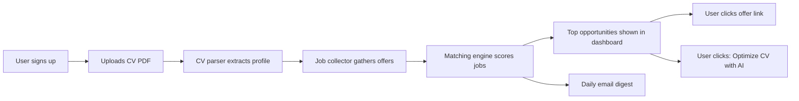
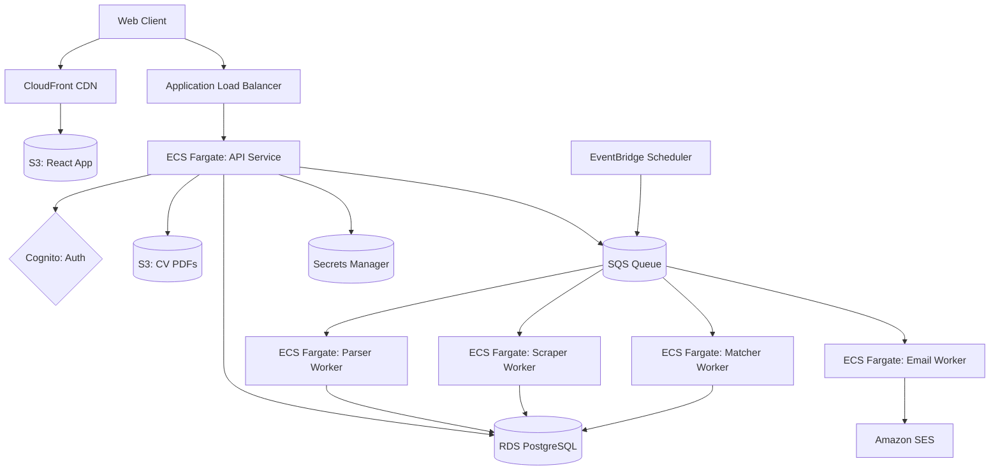
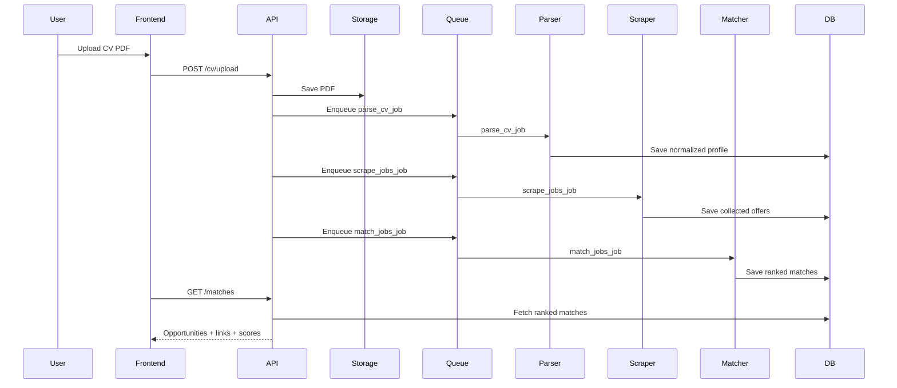
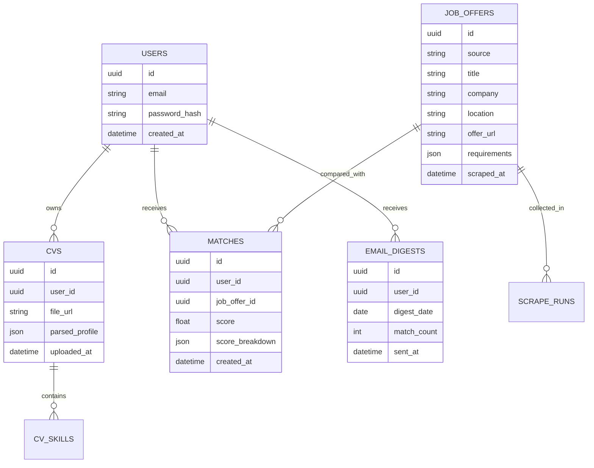

# CV Match

CV Match is a SaaS platform that analyzes user CVs and recommends job opportunities based on profile matching.

## 1) Product Vision

CV Match helps job seekers discover relevant opportunities faster.

The platform:
- Accepts a user CV (PDF).
- Extracts and structures professional data (skills, experience, education, languages, location, seniority).
- Collects job offers from selected web platforms.
- Scores and ranks opportunities by fit.
- Suggests CV optimization for a specific job using AI.
- Sends a daily email digest with the best new matches.

## 2) MVP Scope

### Included in MVP
- User registration and login.
- CV upload in PDF format.
- CV parsing and normalization.
- Job scraping from a controlled set of sources.
- Matching and ranking engine.
- Job list with source link and match score.
- "Optimize CV with AI for this job" action.
- Daily email with new matches.

### Out of Scope (Post-MVP)
- Multi-language CV generation.
- ATS simulation and advanced scoring explainability.
- Team/company accounts.
- Mobile app.
- Fully real-time matching pipeline.

## 3) User Flow



## 4) High-Level Architecture (AWS Native)



**AWS Services Used:**
- **Frontend**: S3 + CloudFront
- **Compute**: ECS Fargate (API + workers)
- **Network**: Application Load Balancer (ALB)
- **Auth**: Amazon Cognito
- **Database**: RDS PostgreSQL
- **Storage**: S3 (CVs, static assets)
- **Async**: SQS + EventBridge Scheduler
- **Email**: Amazon SES
- **Secrets**: AWS Secrets Manager
- **Observability**: CloudWatch Logs, CloudWatch Metrics, X-Ray
- **IaC**: AWS CDK with TypeScript

## 5) Detailed Sequence (MVP)



## 6) Core Data Model (Conceptual)



## 7) API Design (First Endpoints)

- `POST /auth/register`
- `POST /auth/login`
- `POST /cv/upload`
- `GET /profile`
- `GET /matches`
- `POST /matches/{matchId}/optimize-cv`
- `GET /email-digest/preferences`
- `PUT /email-digest/preferences`

## 8) Matching Logic (MVP)

The first scoring model can be transparent and rule-based:

- Skill overlap: 40%
- Seniority fit: 20%
- Domain/industry fit: 15%
- Location/remote compatibility: 15%
- Language fit: 10%

Final score:

$$
match\_score = 0.4S + 0.2E + 0.15D + 0.15L + 0.1Lang
$$

Where each factor is normalized in $[0,1]$.

## 9) Non-Functional Requirements

- Security: encrypted storage, secure auth, rate limits, secret management.
- Reliability: retry policy for scraping/parsing/mailing workers.
- Observability: logs, metrics, and trace IDs across pipeline.
- Performance: asynchronous processing for CPU/network heavy tasks.
- Compliance: user consent for data processing and deletion flow.

## 10) Tech Stack

**Frontend**: React / Vue (deployed to S3 + CloudFront)

**Backend**: FastAPI (Python) or Node.js (deployed to ECS Fargate)

**Infrastructure as Code**: AWS CDK with TypeScript

**Services**:
- Compute: ECS Fargate
- API Gateway: Application Load Balancer (ALB)
- Database: RDS PostgreSQL (Multi-AZ)
- Async: SQS + EventBridge Scheduler
- Auth: Amazon Cognito
- Storage: S3
- Email: Amazon SES
- Observability: CloudWatch Logs, CloudWatch Metrics, X-Ray
- Secrets: AWS Secrets Manager
- CI/CD: GitHub Actions (OIDC to AWS)

## 11) Documentation Structure

This repository includes planning, architecture, design, and implementation documentation:

```text
README.md                         # Product vision and MVP scope
docs/
	planning/
		00-guide.md                   # Planning workflow
		01-project-decisions.md       # Product and system decisions
		roadmap.md                    # Delivery roadmap and milestones
	architecture/
		architecture-aws.md           # System and AWS topology
		integration-diagram.md        # Service interaction view
		authentication.md             # Auth architecture
		deployment.md                 # Runtime and infrastructure deployment
		security.md                   # Security model and controls
		observability.md              # Logs, metrics, traces, alerts
		performance.md                # Performance goals and bottlenecks
	design/
		api.md                        # REST API specification
		database-schema.md            # Data model and indexes
		services/
			api-service.md
			cv-parser-service.md
			scraper-service.md
			matcher-service.md
			notification-service.md
	implementation/
		README.md                     # Implementation documentation index
		infrastructure-cdk.md         # CDK structure placeholder
	operations/
		runbooks/
			job-source-strategy.md
	reference/
		00-service-definition-template.md
		00-service-definition-example-parser.md
		sample/
infra/                            # CDK TypeScript code (to be created)
src/                              # Application code (to be created)
```

**Start here**: Read [docs/planning/00-guide.md](docs/planning/00-guide.md) for the planning workflow, then [docs/architecture/architecture-aws.md](docs/architecture/architecture-aws.md) for the system design.

## 12) Portfolio Narrative (For Recruiters)

When presenting this project, focus on:

- Cloud architecture decisions and tradeoffs.
- Async job processing design.
- Data modeling for matching.
- Reliability, monitoring, and security controls.
- Business value: faster and more relevant job discovery.

## 12) Portfolio Narrative (For Recruiters)

When presenting this project, focus on:

- **Cloud Architecture**: AWS-native design with managed services (Fargate, RDS, SQS, Cognito, SES).
- **Infrastructure as Code**: CDK with TypeScript for reproducible, version-controlled deployments.
- **Async Processing**: Decoupled event-driven pipeline (API ? SQS ? Workers).
- **Observability**: CloudWatch, X-Ray, and custom metrics to monitor production systems.
- **Security**: Least-privilege IAM, encrypted storage, private databases, secret rotation.
- **Scalability**: Auto-scaling services, multi-AZ redundancy, cost-optimized design.
- **CI/CD**: Automated testing, image builds, and deployments via GitHub Actions.
- **Business Value**: Faster job discovery for job seekers via intelligent matching.

## 13) Getting Started

### Before You Code: Plan (Weeks 1-2)

Start in the **planning phase** to make thoughtful decisions before building:

1. **Read the planning guide**: [docs/planning/00-guide.md](docs/planning/00-guide.md)
2. **Fill out decision worksheet**: [docs/planning/01-project-decisions.md](docs/planning/01-project-decisions.md)
   - What are you solving?
   - Which microservices?
   - Async or sync communication?
   - Database strategy?
3. **Define each service**: Use [docs/reference/00-service-definition-template.md](docs/reference/00-service-definition-template.md)
	- Reference example: [docs/reference/00-service-definition-example-parser.md](docs/reference/00-service-definition-example-parser.md)
   - Create one definition per microservice
4. **Outcome**: Clear architecture & service responsibilities before CDK code

### Then: Build (Weeks 3-14)

1. **Read the architecture**: [docs/architecture/architecture-aws.md](docs/architecture/architecture-aws.md)
2. **Follow the roadmap**: [docs/planning/roadmap.md](docs/planning/roadmap.md) outlines the delivery milestones
3. **Set up your environment**:
   ```bash
   npm install -g aws-cdk
   aws configure  # Set up AWS credentials
   cd infra
   npm install
   cdk bootstrap    # One-time setup
   cdk deploy       # Deploy to AWS
   ```
4. **Track progress**: Use the roadmap checklist to stay on course

## 14) Next Milestones

**Month 1** (Weeks 1?4): Core infrastructure (VPC, RDS, ECS, Cognito)

**Month 2** (Weeks 5?8): Async workers and API endpoints

**Month 3** (Weeks 9?12): Observability, security, CI/CD, and load testing

See [docs/planning/roadmap.md](docs/planning/roadmap.md) for detailed weekly tasks and skill-building focus.
