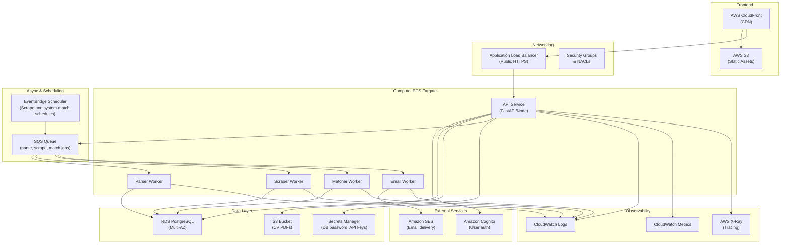

# AWS Architecture - CV Match

## Overview

CV Match is deployed on AWS as a cloud-native microservices architecture. Core workloads run in containerized services on ECS Fargate, with event-driven asynchronous processing via SQS and EventBridge, managed persistence with Aurora PostgreSQL and S3, and integrated observability through CloudWatch and X-Ray.

## Deployment Diagram

## Service-by-Service Details

### Frontend
- **S3 Bucket**: Hosts React/Vue/Angular static app (dist/ files)
- **CloudFront**: CDN for fast global delivery, HTTPS, caching
- **Route 53**: Domain routing

### Public API Entry Point
- **Application Load Balancer**: Routes HTTP/HTTPS traffic to Fargate tasks
- **Security Groups**: Restrict inbound to ALB only
- **ACM Certificate**: Automatic HTTPS

### Compute: ECS Fargate
- **Cluster**: The ECS runtime boundary that groups the API and worker services and hosts their running tasks
- **Service: API**: Long-running public backend behind the ALB, using 1 task in cost-sensitive dev/test environments and 2 tasks when validating load balancing or basic availability in MVP environments
- **Service: Parser**: Queue-driven worker, starting with 1 task for MVP and scaling out only if parse backlog or processing time becomes too high
- **Service: Scraper**: Queue-driven worker, starting with 1 task for MVP and processing one source per scrape job (for example, LinkedIn or Indeed); scales out only when multiple source-specific jobs must run in parallel
- **Service: Matcher**: Queue-driven worker, starting with 1 task for MVP and scaling out only if matching jobs accumulate or completion time becomes too high
- **Service: Notifications**: Queue-driven worker, starting with 1 task for MVP and sending email digests only when eligible events are published by the matching flow

Each service is a Docker container defined in ECR (Elastic Container Registry).

### Database: Aurora PostgreSQL
- **Engine**: PostgreSQL 14+ compatible
- **Why Aurora**: I considered standard RDS PostgreSQL, but I chose Aurora PostgreSQL because it gives a stronger AWS-native story, better scalability, and higher availability while keeping PostgreSQL compatibility
- **Multi-AZ**: Automatic failover and backups
- **Subnet Group**: Private subnets only (no public IP)
- **Security Group**: Ingress from Fargate tasks only
- **Backups**: Automated daily, retained for 7 days
- **Encryption**: Encryption at rest

### Storage: S3
- **Bucket 1**: User-uploaded CVs (private, encrypted)
- **Bucket 2**: Job scraping cache (TTL via lifecycle policies)
- **Bucket 3**: Application logs, exports, and optional deployment artifacts (for example, CDK assets)
- **Versioning**: Enabled on CV bucket
- **Access**: Via IAM role attached to Fargate task

**Note:** Infrastructure as code source stays in the repository; AWS may use S3 internally for deployment assets, but that is separate from product storage.

### Async: SQS + EventBridge
- **SQS Queue**: Standard queue, 5-minute visibility timeout
        - Message types: [`TO BE DEFINED`]
    - Scrape job unit: one message per source so workers can process sources independently
  - DLQ: Captures failed messages for replay
- **EventBridge Rules**:
    - Triggers scheduled scrape jobs
    - Triggers scheduled system-scope matching jobs (for example, with an offset after scraping)

### Auth: Cognito
- **User Pool**: Managed user identities and credentials, with optional MFA for stronger account security
- **App Client**: OAuth 2.0 / OIDC integration used by the frontend to authenticate users and obtain tokens
- **Token Validation**: API service validates Cognito JWTs on protected endpoints before processing requests
- **Custom Domain**: `auth.cv-match.com` optional, improves user experience and branded auth flows
- **User Provisioning**: User profile in Aurora can be created via Post-Confirmation trigger or lazily on first authenticated API call

### Secrets: Secrets Manager
- **Secret Scope**: Stores sensitive runtime configuration only (database credentials, third-party API keys, and AI provider credentials)
- **Least-Privilege Access**: Each ECS service task role reads only the secrets it needs; secrets are not shared broadly across services
- **Runtime Retrieval**: Services fetch secrets at startup or via periodic refresh, avoiding hardcoded credentials in code, images, or environment files committed to source control
- **Rotation Policy**: Automatic rotation enabled where supported (for example, database credentials), with periodic manual rotation for external provider keys that do not support native rotation
- **Auditability**: Access to secrets is logged with CloudTrail and monitored for unusual read patterns

### Observability
- **Logs**: Structured application logs are centralized in Grafana Loki with service, environment, trace_id, and job_id labels
- **Metrics**: Prometheus collects service and queue metrics (latency, throughput, error rate, queue depth, and worker processing time)
- **Tracing**: OpenTelemetry instrumentation propagates trace context across API, SQS, and workers, with traces stored in Tempo
- **AWS Signals**: CloudWatch remains enabled for AWS infrastructure signals (ECS task health, SQS age of oldest message, RDS CPU/storage, ALB 5xx)
- **Dashboards**: Grafana dashboards combine Loki, Prometheus, and Tempo for cross-service triage
- **Alerting**: Grafana Alerting and CloudWatch Alarms cover API error rate/latency, parser and scraper failures, matcher backlog growth, notification send failures, DLQ spikes, and RDS saturation
- **Correlation Standard**: All async messages include trace_id and trigger metadata to preserve end-to-end observability in event-driven flows

## High-Level Data Flow

1. **User uploads CV (API)**
   - API receives PDF
   - Upsert in S3
   - Enqueues `parse_cv_requested` job to `CV Parser Owned Queue`
   - Returns job ID to frontend

2. **CV Parser Worker processes**
   - Dequeues `parse_cv_requested` from `CV Parser Owned Queue`
   - Fetches PDF from S3
   - Parses and normalizes data
   - Upsert CV profile to Aurora PostgreSQL
   - Deletes message from SQS
   - Enqueues `match_jobs_requested(scope=user,user_id,cv_id,trigger_type = upload)` job to `Matching Owned Queue`

3. **Job Scraper Worker processes one source per job**
    - A scheduled workflow enqueues ` scrape_jobs_requested(source,trace_id,trigger_type=scheduled)` job to `Job Scraper Owned Queue`
    - Job scraper worker processes dequeues `scrape_jobs_requested(source,trace_id,trigger_type=scheduled)` from SQS
    - A scraper task connects to the target external job platform source (for example LinkedIn, Indeed, or InfoJobs), fetches raw offers, and normalizes them
    - Upserts normalized offers to Aurora PostgreSQL
    - Deletes message from `Job Scraper Owned Queue`

4. **Matcher Worker runs periodically**
    - Dequeues `match_jobs_requested` from `Job Matching Owned Queue`
     - If `scope=user`, computes matches only for the requested user profile
     - If `scope=system`, computes matches for all eligible users against newly available job offers
    - Fetches user profile + all available jobs
    - Scores and ranks matches
    - Writes matches to Aurora PostgreSQL
    - If `scope=system`, enqueues `notify_requested(match_id,trigger_type=scheduled)` to `Notification Owned Queue` 
    - Deletes message from `Job Matching Owned Queue`

5. **Notification Worker sends digest emails when eligible**
    - Dequeues `notify_requested` from `Notification Owned Queue`
    - Sends digest email via SES
    - Records digest in Aurora PostgreSQL
    - Deletes message from `Notification Owned Queue`

## Security Model

### Network Isolation
- VPC with public and private subnets (multi-AZ)
- Fargate tasks in private subnets (no internet)
- NAT Gateway for outbound (scraping, SES)
- Security groups enforce task-to-task communication

### Identity & Access
- IAM role per Fargate service (least privilege)
- API role: Read/write RDS, read/write S3, SQS send/receive, Secrets read
- Worker role: Read/write RDS, read S3, SQS receive, SES send

### Data Protection
- RDS encryption at rest (KMS)
- S3 encryption at rest (default AES-256)
- Cognito password hashing (bcrypt-like)
- TLS 1.2+ for all traffic

### Compliance
- User deletion flow: soft-delete CV and all related matches
- Audit log: all CV uploads/optimizations logged with timestamp
- No persistent logs of raw CV content

## Scalability

### Horizontal
- **API Service**: ALB + auto-scaling, typically starting at 1 task in dev/test and 2 tasks in production-like MVP environments, then scaling horizontally based on CPU, memory, or request load
- **Worker Services**: Auto-scaling based on SQS queue depth
- **RDS**: Read replicas (optional) for reporting queries

### Vertical
- Fargate task sizes: 256 CPU / 512 MB to 4096 CPU / 30 GB
- RDS instance class: db.t3.micro to db.m5.4xlarge

## Cost Estimation (USD/month, free tier included)

| Service | Usage | Cost |
|---------|-------|------|
| ECS Fargate | 100 GB-hours/month (4 services) | $20 |
| Aurora PostgreSQL | Serverless or small provisioned cluster | $15+ |
| S3 | 100 GB stored, 1M requests | $5 |
| ALB | 1 LCU equivalent | $18 |
| CloudFront | 1 TB transfer | $85 |
| SQS | 1M messages/month | $0.40 |
| SES | 50k emails/month | $0 (free tier) |
| **Total** | | **~$143** |

Free tier can reduce this by ~30%.

## Deployment via AWS CDK (TypeScript)

See [../implementation/infrastructure-cdk.md](../implementation/infrastructure-cdk.md) for the CDK module layout and deployment instructions.

