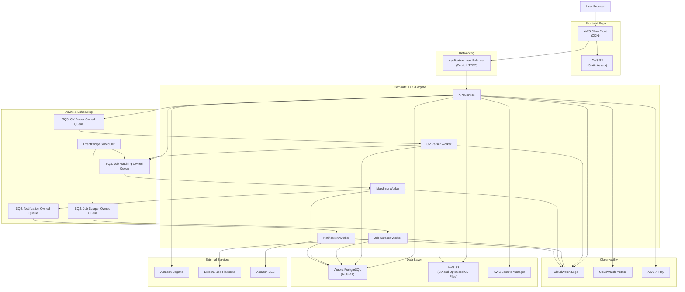

## Deployment Diagram

In this diagram, we can see where each major component runs in AWS and how infrastructure boundaries are defined.

```mermaid
graph TB
    USER["User Browser"]

    subgraph "Frontend Edge"
        CF["AWS CloudFront<br/>(CDN)"]
        S3_FE["AWS S3<br/>(Static Assets)"]
    end

    subgraph "Networking"
        ALB["Application Load Balancer<br/>(Public HTTPS)"]
    end

    subgraph "Compute: ECS Fargate"
        API["API Service"]
        PARSER["CV Parser Worker"]
        SCRAPER["Job Scraper Worker"]
        MATCHER["Matching Worker"]
        NOTIFIER["Notification Worker"]
    end

    subgraph "Data Layer"
        RDS["Aurora PostgreSQL<br/>(Multi-AZ)"]
        S3_CV["AWS S3<br/>(CV and Optimized CV Files)"]
        SECRETS["AWS Secrets Manager"]
    end

    subgraph "Async & Scheduling"
        QP["SQS: CV Parser Owned Queue"]
        QS["SQS: Job Scraper Owned Queue"]
        QM["SQS: Job Matching Owned Queue"]
        NQ["SQS: Notification Owned Queue"]
        EB["EventBridge Scheduler"]
    end

    subgraph "External Services"
        COGNITO["Amazon Cognito"]
        JOBS["External Job Platforms"]
        SES["Amazon SES"]
    end

    subgraph "Observability"
        CW_LOGS["CloudWatch Logs"]
        CW_METRICS["CloudWatch Metrics"]
        XRAY["AWS X-Ray"]
    end

    USER --> CF
    CF --> S3_FE
    CF --> ALB
    ALB --> API

    API --> COGNITO
    API --> RDS
    API --> S3_CV
    API --> QP
    API --> QM
    API --> SECRETS

    EB --> QS
    EB --> QM

    QP --> PARSER
    QS --> SCRAPER
    QM --> MATCHER
    NQ --> NOTIFIER

    PARSER --> S3_CV
    PARSER --> RDS
    PARSER --> QM

    SCRAPER --> JOBS
    SCRAPER --> RDS

    MATCHER --> RDS
    MATCHER --> NQ

    NOTIFIER --> SES
    NOTIFIER --> RDS

    API --> CW_LOGS
    PARSER --> CW_LOGS
    SCRAPER --> CW_LOGS
    MATCHER --> CW_LOGS
    NOTIFIER --> CW_LOGS

    API --> CW_METRICS
    API --> XRAY
```