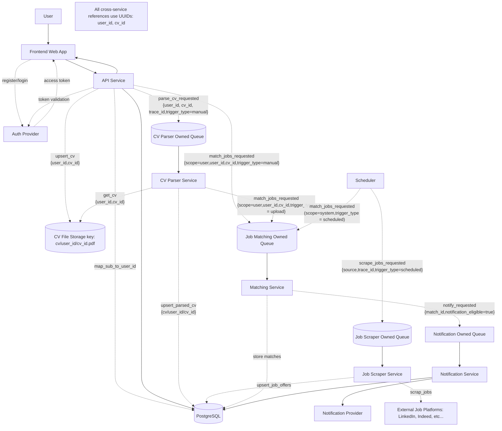

# Integration Diagram

```mermaid
flowchart TB
  U[User] --> FE[Frontend Web App]
  FE -. register/login .-> AUTH[Auth Provider]
  AUTH -. access token .-> FE
  FE --> API[API Service]
  API -. token validation .-> AUTH
  EB[Scheduler]
  NOTE1[All cross-service references use UUIDs: user_id, cv_id]

  API -. upsert_cv\n{user_id,cv_id} .-> S3[(CV File Storage key: cv/user_id/cv_id.pdf)]
  API -. map_sub_to_user_id .-> RDS
  API --> RDS[(PostgreSQL)]

  API -. parse_cv_requested\n{user_id, cv_id, trace_id,trigger_type=manual} .-> QP[(CV Parser Owned Queue)]
  EB -. scrape_jobs_requested\n{source,trace_id,trigger_type=scheduled} .-> QS[(Job Scraper Owned Queue)]
  API -. match_jobs_requested\n{scope=user,user_id,cv_id,trigger_type=manual} .-> QM[(Job Matching Owned Queue)]

  QP --> PARSER[CV Parser Service]
  QS --> SCRAPER[Job Scraper Service]
  QM --> MATCHER[Matching Service]

  PARSER -. get_cv\n{user_id,cv_id}.-> S3
  PARSER -. upsert_parsed_cv\n{cv/user_id/cv_id} .-> RDS
  PARSER -. match_jobs_requested\n{scope=user,user_id,cv_id,trigger_type = upload} .-> QM
  SCRAPER -. upsert_job_offers.-> RDS
  EB -. match_jobs_requested\n(scope=system,trigger_type = scheduled) .-> QM
  MATCHER -. store matches .-> RDS
MATCHER -. notify_requested\n{match_id,notification_eligible=true} .-> NQ[Notification Owned Queue]

  SCRAPER -. scrap_jobs.-> JOBS[External Job Platforms: LinkedIn, Indeed, etc...]

  %% Notification is sent only when matcher publishes new_matches_available
  NQ --> NOTIFICATION[Notification Service]
  NOTIFICATION --> SES[Notification Provider]
  NOTIFICATION --> RDS

  API --> FE
```
