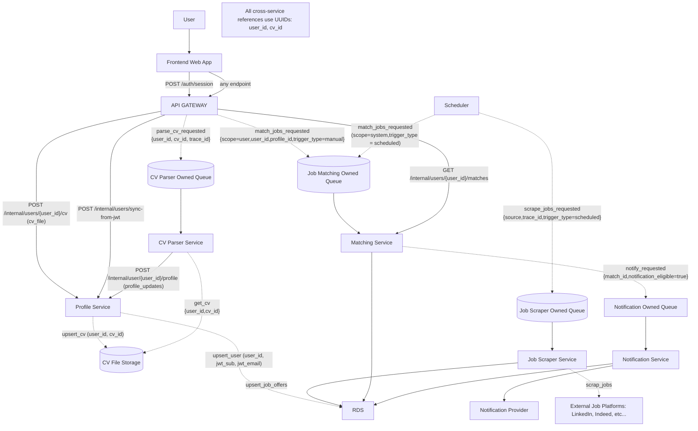

## Integration Diagram

```mermaid
flowchart TB
  U[User] --> FE[Frontend Web App]
  FE -- POST /auth/session --> API[API GATEWAY]
  FE -- any endpoint --> API[API GATEWAY]

  EB[Scheduler]
  NOTE1[All cross-service references use UUIDs: user_id, cv_id]

  API -- POST /internal/users/{user_id}/cv (cv_file) --> PROFILE[Profile Service]
  PROFILE -. upsert_cv (user_id, cv_id) .-> S3[(CV File Storage)]
  API -- POST /internal/users/sync-from-jwt --> PROFILE

  PROFILE -. upsert_user (user_id, jwt_sub, jwt_email) .-> RDS

  API -. parse_cv_requested\n{user_id, cv_id, trace_id} .-> QP[(CV Parser Owned Queue)]
  EB -. scrape_jobs_requested\n{source,trace_id,trigger_type=scheduled} .-> QS[(Job Scraper Owned Queue)]
  API -. match_jobs_requested\n{scope=user,user_id,profile_id,trigger_type=manual} .-> QM[(Job Matching Owned Queue)]

  QP --> PARSER[CV Parser Service]
  QS --> SCRAPER[Job Scraper Service]
  QM --> MATCHER[Matching Service]

  API -- GET /internal/users/{user_id}/matches --> MATCHER[Matching Service]

  PARSER -. get_cv\n{user_id,cv_id}.-> S3
  PARSER -- POST /internal/user/{user_id}/profile (profile_updates) --> PROFILE
  
  SCRAPER -- upsert_job_offers --> RDS
  EB -. match_jobs_requested\n(scope=system,trigger_type = scheduled) .-> QM
  MATCHER --> RDS
MATCHER -. notify_requested\n{match_id,notification_eligible=true} .-> NQ[Notification Owned Queue]

  SCRAPER -. scrap_jobs.-> JOBS[External Job Platforms: LinkedIn, Indeed, etc...]

  %% Notification is sent only when matcher publishes new_matches_available
  NQ --> NOTIFICATION[Notification Service]
  NOTIFICATION --> SES[Notification Provider]
  NOTIFICATION --> RDS

```