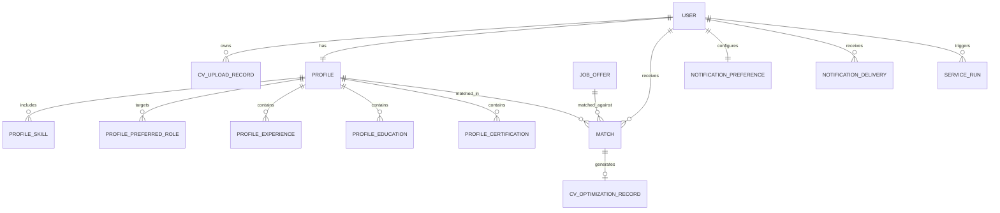

# Database Schema

## Purpose

Define the shared PostgreSQL data model for CV Match, including user identities, CV records, profiles, job offers, match results, notification preferences, and service-run metadata. The database is the system of record for business data, while file storage and background services handle large artifacts and asynchronous processing.

## Design Principles

- Single source of truth: each business entity has one canonical record in the database.
- User ownership: user-related data is always linked to the authenticated Cognito identity.
- Separation of concerns: raw files live in object storage, while structured metadata and results live in PostgreSQL.
- Async-friendly modeling: long-running processes store job state, status, and timestamps so the frontend can poll safely.
- Minimal duplication: derived data is stored only when it improves query speed or UX; otherwise it should be computed on demand.
- Traceability: important state changes keep timestamps and correlation fields for auditability and debugging.
- Safe deletion and retention: personal data and generated artifacts follow explicit lifecycle and retention rules.

## Core Entities

### Users

Primary table for authenticated application users.

Key fields:
- `id` (internal primary key)
- `cognito_sub` (Cognito identity reference)
- `email`
- `status` (for example: active, suspended, deleted)
- `created_at`
- `updated_at`

Notes:
- Owner service: [PROFILE Service](services/1-profile-service.md)
- One row per application user.
- `cognito_sub` must be unique and is the main link between Cognito and the database user record.

### CV Upload Records

Stores CV upload artifact metadata, storage references, and parsing lifecycle status.

Key fields:
- `id`
- `user_id`
- `original_filename`
- `storage_key` (object storage reference)
- `content_type`
- `parse_status` (pending, processing, completed, failed)
- `parse_error_code` (nullable)
- `uploaded_at`
- `parsed_at` (nullable)
- `is_active`

Notes:
- Owner service: [CV Parser Service](services/2-cv-parser-service.md)
- The database stores metadata, not the raw file bytes.
- A user can have multiple CV upload records over time; exactly one can be marked active.
- The uploaded file binary is stored in object storage (S3) and referenced by `storage_key`.
- Parsed structured output from that CV is persisted in database profile tables (`Profiles`, `Profile Skills`, `Profile Preferred Roles`, `Profile Experience`, `Profile Education`, and `Profile Certifications`).

### Profiles

Stores the structured user profile used for matching and presentation.

Key fields:
- `user_id`
- `full_name`
- `headline`
- `summary`
- `country_code` (ISO 3166-1 alpha-2)
- `country_name`
- `region` (state/province)
- `city`
- `postal_code`
- `years_experience`
- `remote_preference`
- `work_mode_preference`
- `profile_completion_percent`
- `latest_source_cv_id` (nullable)
- `last_auto_filled_at` (nullable)
- `last_manual_edit_at` (nullable)
- `updated_at`

Notes:
- Owner service: [PROFILE Service](services/1-profile-service.md)
- This table is the canonical source for the user?s public profile data.
- CV parsing can populate or refresh profile content.
- The API `GET /profile` response is assembled from this table plus related profile sub-entities.
- `GET /profile` also joins identity fields from `Users` (for example `email`) and CV summary fields from `CV Upload Records`.
- The API can still expose a single `location` display string by composing `city`, `region`, and `country_name`.
- `latest_source_cv_id` tracks which CV upload record most recently auto-populated the profile for traceability.
- Manual edits are first-class and can overwrite auto-filled values.
- Parsed CV data is materialized here and in profile sub-entities, not stored as file content.

### Profile Skills

Normalized list of skills attached to a profile.

Key fields:
- `id`
- `profile_id`
- `skill_name`
- `normalized_skill`
- `category` (for example: backend, cloud, data)
- `proficiency_level` (optional)
- `sort_order`

Notes:
- Owner service: [PROFILE Service](services/1-profile-service.md)
- Stored as a separate table to support search, filtering, and ranking.
- Multiple skills can be linked to the same profile.

### Profile Preferred Roles

Normalized list of role targets selected or inferred for a profile.

Key fields:
- `id`
- `profile_id`
- `role_name`
- `normalized_role`
- `sort_order`

Notes:
- Owner service: [PROFILE Service](services/1-profile-service.md)
- Represents the `preferred_roles` array from `GET /profile`.
- Keeping roles normalized helps filtering and ranking against job titles.

### Profile Experience

Work history records associated with a profile.

Key fields:
- `id`
- `profile_id`
- `position`
- `company`
- `start_date`
- `end_date` (nullable)
- `is_current`
- `responsibilities` (array or JSON list)
- `sort_order`

Notes:
- Owner service: [PROFILE Service](services/1-profile-service.md)
- Represents the `experience` array from `GET /profile`.
- Can be sourced from CV parsing and later edited by the user.

### Profile Education

Education history records associated with a profile.

Key fields:
- `id`
- `profile_id`
- `degree`
- `institution`
- `start_date` (nullable)
- `end_date` (nullable)
- `status` (for example: completed, in_progress, dropped)
- `sort_order`

Notes:
- Owner service: [PROFILE Service](services/1-profile-service.md)
- Represents the `education` array from `GET /profile`.
- Stored separately so profile retrieval stays rich without overloading the base profile row.

### Profile Certifications

Professional certifications associated with a profile.

Key fields:
- `id`
- `profile_id`
- `name`
- `issuer`
- `issued_at` (nullable)
- `expires_at` (nullable)

Notes:
- Owner service: [PROFILE Service](services/1-profile-service.md)
- Represents the `certifications` array from `GET /profile`.
- Useful for filtering and relevance scoring in matching.

### Job Offers

Canonical job posting data used for matching.

Key fields:
- `id`
- `external_source`
- `external_job_id`
- `title`
- `company`
- `location`
- `work_mode`
- `employment_type`
- `seniority`
- `salary_min`
- `salary_max`
- `salary_currency`
- `posted_at`
- `apply_url`
- `source_url`
- `status` (for example: active, expired, archived)

Notes:
- Owner service: [Job Scraper Service](services/3-scraper-service.md)
- Job offers can come from multiple sources and should be deduplicated by source identity.
- Matching logic reads from this table, but the UI should only see user-facing offer data.

### Matches

Represents the ranked relationship between a user profile and a job offer.

Key fields:
- `id`
- `user_id`
- `profile_id`
- `job_offer_id`
- `match_score`
- `match_status` (for example: pending, scored, accepted, rejected)
- `matched_at`
- `updated_at`
- `rank_reason_summary` (optional)

Notes:
- Owner service: [Matching Service](services/4-matching-service.md)
- One match links one user profile to one job offer.
- The CV is used upstream to parse and enrich the profile, but it is not the main matching entity.
- Optimized CV output should be stored in a dedicated entity linked to the match, not embedded directly in this table.
- Detailed scoring inputs can remain internal, while a short summary can be exposed to the client.

### CV Optimization Records

Stores metadata and lifecycle state for generated CV optimizations tied to a specific match.

Key fields:
- `id`
- `match_id`
- `user_id`
- `storage_key` (object storage reference)
- `status` (pending, processing, completed, failed)
- `error_code` (nullable)
- `generated_at` (nullable)
- `expires_at` (nullable)
- `created_at`
- `updated_at`

Notes:
- Owner service: [CV Optimization Service](services/6-cv-optimizater-service.md)
- This table separates optimization lifecycle concerns from match scoring data.
- Generated optimized CV file binaries are stored in object storage (S3), while this table stores metadata and status.
- For the current product scope, enforce at most one optimization record per match.
- If versioning is needed later, this model can evolve without changing the `matches` table shape.

### Notification Preferences

Stores the user?s current notification settings.

Key fields:
- `user_id`
- `email_enabled`
- `push_enabled`
- `whatsapp_enabled`
- `telegram_enabled`
- `sms_enabled`
- `frequency`
- `updated_at`

Notes:
- Owner service: [Notification Service](services/5-notification-service.md) (managed through API endpoint boundary).
- This is the source of truth for notification channel preferences.
- The API can expose a summary of this table in profile, but the dedicated endpoint remains the primary contract.

### Notification Deliveries

Tracks messages sent to users through each channel.

Key fields:
- `id`
- `user_id`
- `channel`
- `template_name`
- `status` (queued, sent, delivered, failed)
- `provider_message_id` (nullable)
- `sent_at` (nullable)
- `delivered_at` (nullable)
- `failed_at` (nullable)
- `error_code` (nullable)

Notes:
- Owner service: [Notification Service](services/notification-service.md)
- Used for delivery history, retries, and troubleshooting.
- This table is operational and should not be treated as user profile data.

## Relationships

Relationship notes:
- A user owns one or more CV upload records over time, but only one should be active at a time.
- A user has one canonical profile, which can be enriched by CV parsing.
- A profile can have many skills, and each skill belongs to one profile.
- A profile can also have many preferred roles, experience items, education items, and certifications.
- A match always ties one user profile and one job offer together.
- A CV is an input artifact used to populate or refresh the profile, not the primary side of matching.
- CV binary content remains in S3, while parsed CV information is persisted in the relational profile model.
- A profile may reference the latest source CV that auto-filled it, enabling reprocessing and audit.
- A match can produce zero or one CV optimization record for that specific job context.
- Notification preferences are one-to-one with the user, while deliveries are one-to-many.
- Service-run tables are operational and may track multiple jobs per user or per request.

