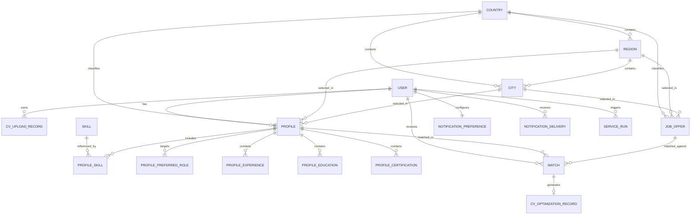

# Database Schema

## Purpose

Define the shared PostgreSQL data model for CV Match, including user identities, CV records, profiles, job offers, match results, notification preferences, and service-run metadata. The database is the system of record for business data, while file storage and background services handle large artifacts and asynchronous processing.

## Design Principles

- Single source of truth: each business entity has one canonical record in the database.
- User ownership: user-related data is always linked to the authenticated Cognito identity.
- Separation of concerns: raw files live in object storage, while structured metadata and results live in PostgreSQL.
- Async-friendly modeling: long-running processes store job state, status, and timestamps so the frontend can poll safely.
- Minimal duplication: derived data is stored only when it improves query speed or UX; otherwise it should be computed on demand.
- Traceability: important state changes keep timestamps and correlation fields for auditability and debugging.
- Safe deletion and retention: personal data and generated artifacts follow explicit lifecycle and retention rules.

## Core Entities

### Users

Primary table for authenticated application users.

Key fields:
- `id` (internal primary key)
- `cognito_sub` (Cognito identity reference)
- `email`
- `email_verified`
- `status` (for example: active, suspended, deleted)
- `last_synced_from_cognito_at` (nullable)
- `created_at`
- `updated_at`

Notes:
- Owner service: [PROFILE Service](services/1-profile-service.md)
- One row per application user.
- `cognito_sub` must be unique and is the main link between Cognito and the database user record.
- This table is the identity bridge (`cognito_sub -> id`) for the rest of the business schema.
- `email` is an account attribute synchronized from Cognito, not the primary identity key.

### CV Upload Records

Stores CV upload artifact metadata, storage references, and parsing lifecycle status.

Key fields:
- `id`
- `user_id`
- `original_filename`
- `storage_key` (object storage reference)
- `content_type`
- `parse_status` (pending, processing, completed, failed)
- `parse_error_code` (nullable)
- `uploaded_at`
- `parsed_at` (nullable)
- `is_active`

Notes:
- Owner service: [CV Parser Service](services/2-cv-parser-service.md)
- The database stores metadata, not the raw file bytes.
- A user can have multiple CV upload records over time; exactly one can be marked active.
- The uploaded file binary is stored in object storage (S3) and referenced by `storage_key`.
- Parsed structured output from that CV is persisted in database profile tables (`Profiles`, `Skills`, `Profile Skills`, `Profile Preferred Roles`, `Profile Experience`, `Profile Education`, and `Profile Certifications`).

### Profiles

Stores the structured user profile used for matching and presentation.

Key fields:
- `user_id`
- `full_name`
- `headline`
- `summary`
- `country_code` (ISO 3166-1 alpha-2)
- `region_id` (nullable reference to `Regions`)
- `city_id` (nullable reference to `Cities`)
- `raw_region` (nullable imported or unnormalized value)
- `raw_city` (nullable imported or unnormalized value)
- `years_experience`
- `work_mode_preference`
- `latest_source_cv_id` (nullable)
- `last_auto_filled_at` (nullable)
- `last_manual_edit_at` (nullable)
- `created_at`
- `updated_at`

Notes:
- Owner service: [PROFILE Service](services/1-profile-service.md)
- This table is the canonical source for the user?s public profile data.
- CV parsing can populate or refresh profile content.
- The API `GET /profile` response is assembled from this table plus related profile sub-entities.
- `GET /profile` also joins identity fields from `Users` (for example `email`) and CV summary fields from `CV Upload Records`.
- The API can still expose a single `location` display string by composing normalized city, region, and country metadata.
- `latest_source_cv_id` tracks which CV upload record most recently auto-populated the profile for traceability.
- Manual edits are first-class and can overwrite auto-filled values.
- Parsed CV data is materialized here and in profile sub-entities, not stored as file content.
- Keep derived fields (for example profile completion percentage) outside this table and compute them in the service layer.
- `raw_region` and `raw_city` are useful for CV-import audit and fallback normalization, but matching and filtering should use the normalized foreign keys.

### Location Reference Data

Stores normalized location values used by profile validation, filtering, and matching.

#### Countries

Key fields:
- `code` (ISO 3166-1 alpha-2 primary key)
- `name`
- `normalized_name`
- `created_at`
- `updated_at`

Notes:
- Owner service: [PROFILE Service](services/1-profile-service.md)
- This is the canonical country catalog for profile and job normalization.
- `Profiles.country_code` should always reference this table.

#### Regions

Key fields:
- `id`
- `country_code`
- `name`
- `normalized_name`
- `code` (nullable local administrative code)
- `created_at`
- `updated_at`

Notes:
- Owner service: [PROFILE Service](services/1-profile-service.md)
- Stores normalized first-level administrative divisions such as states, provinces, or autonomous communities.
- Unique by country plus normalized name.

#### Cities

Key fields:
- `id`
- `country_code`
- `region_id` (nullable)
- `name`
- `normalized_name`
- `created_at`
- `updated_at`

Notes:
- Owner service: [PROFILE Service](services/1-profile-service.md)
- Stores normalized city values used by profile matching and filtering.
- `region_id` can be nullable for countries where region coverage is incomplete during early rollout.
- Unique by country, region, and normalized name.

### Skills

Global catalog of normalized skills available across the platform.

Key fields:
- `id`
- `skill_name`
- `normalized_skill`
- `category` (for example: backend, cloud, data)
- `created_at`
- `updated_at`

Notes:
- Owner service: [PROFILE Service](services/1-profile-service.md)
- One row per canonical skill label.
- Used to keep skill naming consistent across profiles, matching, and search.

### Profile Skills

User-specific skill assignments for a profile, including proficiency metadata.

Key fields:
- `id`
- `profile_id`
- `skill_id`
- `proficiency_level` (optional)
- `sort_order`

Notes:
- Owner service: [PROFILE Service](services/1-profile-service.md)
- Links a profile to a global skill from `Skills`.
- Stores user-specific metadata such as proficiency level and display order.
- Multiple skills can be linked to the same profile, and the same global skill can be reused by many profiles.

### Profile Preferred Roles

Normalized list of role targets selected or inferred for a profile.

Key fields:
- `id`
- `profile_id`
- `role_name`
- `normalized_role`
- `sort_order`

Notes:
- Owner service: [PROFILE Service](services/1-profile-service.md)
- Represents the `preferred_roles` array from `GET /profile`.
- Keeping roles normalized helps filtering and ranking against job titles.

### Profile Experience

Work history records associated with a profile.

Key fields:
- `id`
- `profile_id`
- `position`
- `company`
- `start_date`
- `end_date` (nullable)
- `is_current`
- `responsibilities` (array or JSON list)
- `sort_order`

Notes:
- Owner service: [PROFILE Service](services/1-profile-service.md)
- Represents the `experience` array from `GET /profile`.
- Can be sourced from CV parsing and later edited by the user.

### Profile Education

Education history records associated with a profile.

Key fields:
- `id`
- `profile_id`
- `degree`
- `institution`
- `start_date` (nullable)
- `end_date` (nullable)
- `status` (for example: completed, in_progress, dropped)
- `sort_order`

Notes:
- Owner service: [PROFILE Service](services/1-profile-service.md)
- Represents the `education` array from `GET /profile`.
- Stored separately so profile retrieval stays rich without overloading the base profile row.

### Profile Certifications

Professional certifications associated with a profile.

Key fields:
- `id`
- `profile_id`
- `name`
- `issuer`
- `issued_at` (nullable)
- `expires_at` (nullable)

Notes:
- Owner service: [PROFILE Service](services/1-profile-service.md)
- Represents the `certifications` array from `GET /profile`.
- Useful for filtering and relevance scoring in matching.

### Job Offers

Canonical job posting data used for matching.

Key fields:
- `id`
- `external_source`
- `external_job_id`
- `title`
- `company`
- `country_code` (nullable ISO 3166-1 alpha-2 reference)
- `region_id` (nullable reference to `Regions`)
- `city_id` (nullable reference to `Cities`)
- `raw_location` (nullable original source location text)
- `work_mode`
- `employment_type`
- `seniority`
- `salary_min`
- `salary_max`
- `salary_currency`
- `posted_at`
- `apply_url`
- `source_url`
- `status` (for example: active, expired, archived)

Notes:
- Owner service: [Job Scraper Service](services/3-scraper-service.md)
- Job offers can come from multiple sources and should be deduplicated by source identity.
- Matching and filtering should use normalized location references when available.
- `raw_location` preserves the original scraped location text for audit and re-normalization.
- Matching logic reads from this table, but the UI should only see user-facing offer data.

### Matches

Represents the ranked relationship between a user profile and a job offer.

Key fields:
- `id`
- `user_id`
- `profile_id`
- `job_offer_id`
- `match_score`
- `match_status` (for example: pending, scored, accepted, rejected)
- `matched_at`
- `updated_at`
- `rank_reason_summary` (optional)

Notes:
- Owner service: [Matching Service](services/4-matching-service.md)
- One match links one user profile to one job offer.
- The CV is used upstream to parse and enrich the profile, but it is not the main matching entity.
- Optimized CV output should be stored in a dedicated entity linked to the match, not embedded directly in this table.
- Detailed scoring inputs can remain internal, while a short summary can be exposed to the client.

### CV Optimization Records

Stores metadata and lifecycle state for generated CV optimizations tied to a specific match.

Key fields:
- `id`
- `match_id`
- `user_id`
- `storage_key` (object storage reference)
- `status` (pending, processing, completed, failed)
- `error_code` (nullable)
- `generated_at` (nullable)
- `expires_at` (nullable)
- `created_at`
- `updated_at`

Notes:
- Owner service: [CV Optimization Service](services/6-cv-optimizater-service.md)
- This table separates optimization lifecycle concerns from match scoring data.
- Generated optimized CV file binaries are stored in object storage (S3), while this table stores metadata and status.
- For the current product scope, enforce at most one optimization record per match.
- If versioning is needed later, this model can evolve without changing the `matches` table shape.

### Notification Preferences

Stores the user?s current notification settings.

Key fields:
- `user_id`
- `email_enabled`
- `push_enabled`
- `whatsapp_enabled`
- `telegram_enabled`
- `sms_enabled`
- `frequency`
- `updated_at`

Notes:
- Owner service: [Notification Service](services/5-notification-service.md) (managed through API endpoint boundary).
- This is the source of truth for notification channel preferences.
- The API can expose a summary of this table in profile, but the dedicated endpoint remains the primary contract.

### Notification Deliveries

Tracks messages sent to users through each channel.

Key fields:
- `id`
- `user_id`
- `channel`
- `template_name`
- `status` (queued, sent, delivered, failed)
- `provider_message_id` (nullable)
- `sent_at` (nullable)
- `delivered_at` (nullable)
- `failed_at` (nullable)
- `error_code` (nullable)

Notes:
- Owner service: [Notification Service](services/notification-service.md)
- Used for delivery history, retries, and troubleshooting.
- This table is operational and should not be treated as user profile data.


## Relationships



Relationship notes:
- A user owns one or more CV upload records over time, but only one should be active at a time.
- A user has one canonical profile, which can be enriched by CV parsing.
- A profile references normalized country, region, and city records for reliable filtering and matching, while raw imported location text can still be retained for audit and fallback normalization.
- A job offer can also reference normalized country, region, and city records, while keeping the raw scraped location text for traceability.
- A profile can have many skills, and each profile skill points to one global skill in the platform catalog.
- A profile can also have many preferred roles, experience items, education items, and certifications.
- A match always ties one user profile and one job offer together.
- A CV is an input artifact used to populate or refresh the profile, not the primary side of matching.
- CV binary content remains in S3, while parsed CV information is persisted in the relational profile model.
- A profile may reference the latest source CV that auto-filled it, enabling reprocessing and audit.
- A match can produce zero or one CV optimization record for that specific job context.
- Notification preferences are one-to-one with the user, while deliveries are one-to-many.
- Service-run tables are operational and may track multiple jobs per user or per request.

## PostgreSQL DDL v2 (Matching-Oriented Reference)

The following DDL is a professional baseline for production matching systems. It separates canonical business data from feature snapshots and ranking outputs, so scoring logic can evolve safely over time.

```sql
-- Optional extension for future embedding support.
-- CREATE EXTENSION IF NOT EXISTS vector;

-- =============================
-- Canonical identity and profile
-- =============================

CREATE TABLE users (
	id BIGSERIAL PRIMARY KEY,
	cognito_sub TEXT NOT NULL UNIQUE,
	email TEXT NOT NULL,
	email_verified BOOLEAN NOT NULL DEFAULT FALSE,
	status TEXT NOT NULL DEFAULT 'active',
	last_synced_from_cognito_at TIMESTAMPTZ,
	created_at TIMESTAMPTZ NOT NULL DEFAULT NOW(),
	updated_at TIMESTAMPTZ NOT NULL DEFAULT NOW(),
	deleted_at TIMESTAMPTZ,
	CHECK (status IN ('active', 'suspended', 'deleted'))
);

CREATE TABLE cv_upload_records (
	id BIGSERIAL PRIMARY KEY,
	user_id BIGINT NOT NULL REFERENCES users(id) ON DELETE CASCADE,
	original_filename TEXT NOT NULL,
	storage_key TEXT NOT NULL,
	content_type TEXT NOT NULL,
	parse_status TEXT NOT NULL DEFAULT 'pending',
	parse_error_code TEXT,
	uploaded_at TIMESTAMPTZ NOT NULL DEFAULT NOW(),
	parsed_at TIMESTAMPTZ,
	is_active BOOLEAN NOT NULL DEFAULT FALSE,
	created_at TIMESTAMPTZ NOT NULL DEFAULT NOW(),
	updated_at TIMESTAMPTZ NOT NULL DEFAULT NOW(),
	CHECK (parse_status IN ('pending', 'processing', 'completed', 'failed'))
);

-- Guarantees at most one active CV per user.
CREATE UNIQUE INDEX uq_cv_upload_records_one_active_per_user
ON cv_upload_records (user_id)
WHERE is_active = TRUE;

CREATE TABLE countries (
	code CHAR(2) PRIMARY KEY,
	name TEXT NOT NULL,
	normalized_name TEXT NOT NULL UNIQUE,
	created_at TIMESTAMPTZ NOT NULL DEFAULT NOW(),
	updated_at TIMESTAMPTZ NOT NULL DEFAULT NOW()
);

CREATE TABLE regions (
	id BIGSERIAL PRIMARY KEY,
	country_code CHAR(2) NOT NULL REFERENCES countries(code) ON DELETE CASCADE,
	name TEXT NOT NULL,
	normalized_name TEXT NOT NULL,
	code TEXT,
	created_at TIMESTAMPTZ NOT NULL DEFAULT NOW(),
	updated_at TIMESTAMPTZ NOT NULL DEFAULT NOW(),
	UNIQUE (country_code, normalized_name)
);

CREATE TABLE cities (
	id BIGSERIAL PRIMARY KEY,
	country_code CHAR(2) NOT NULL REFERENCES countries(code) ON DELETE CASCADE,
	region_id BIGINT REFERENCES regions(id) ON DELETE SET NULL,
	name TEXT NOT NULL,
	normalized_name TEXT NOT NULL,
	created_at TIMESTAMPTZ NOT NULL DEFAULT NOW(),
	updated_at TIMESTAMPTZ NOT NULL DEFAULT NOW(),
	UNIQUE (country_code, region_id, normalized_name)
);

CREATE TABLE profiles (
	id BIGSERIAL PRIMARY KEY,
	user_id BIGINT NOT NULL UNIQUE REFERENCES users(id) ON DELETE CASCADE,
	full_name TEXT,
	headline TEXT,
	summary TEXT,
	country_code CHAR(2) REFERENCES countries(code) ON DELETE RESTRICT,
	region_id BIGINT REFERENCES regions(id) ON DELETE SET NULL,
	city_id BIGINT REFERENCES cities(id) ON DELETE SET NULL,
	raw_region TEXT,
	raw_city TEXT,
	years_experience NUMERIC(4,1),
	work_mode_preference TEXT,
	latest_source_cv_id BIGINT REFERENCES cv_upload_records(id) ON DELETE SET NULL,
	last_auto_filled_at TIMESTAMPTZ,
	last_manual_edit_at TIMESTAMPTZ,
	created_at TIMESTAMPTZ NOT NULL DEFAULT NOW(),
	updated_at TIMESTAMPTZ NOT NULL DEFAULT NOW(),
	CHECK (years_experience IS NULL OR years_experience >= 0),
	CHECK (work_mode_preference IS NULL OR work_mode_preference IN ('remote', 'hybrid', 'onsite', 'flexible'))
);

CREATE TABLE skills (
	id BIGSERIAL PRIMARY KEY,
	skill_name TEXT NOT NULL,
	normalized_skill TEXT NOT NULL UNIQUE,
	category TEXT,
	created_at TIMESTAMPTZ NOT NULL DEFAULT NOW(),
	updated_at TIMESTAMPTZ NOT NULL DEFAULT NOW()
);

CREATE TABLE skill_aliases (
	id BIGSERIAL PRIMARY KEY,
	skill_id BIGINT NOT NULL REFERENCES skills(id) ON DELETE CASCADE,
	alias TEXT NOT NULL,
	normalized_alias TEXT NOT NULL UNIQUE,
	created_at TIMESTAMPTZ NOT NULL DEFAULT NOW()
);

CREATE TABLE profile_skills (
	id BIGSERIAL PRIMARY KEY,
	profile_id BIGINT NOT NULL REFERENCES profiles(id) ON DELETE CASCADE,
	skill_id BIGINT NOT NULL REFERENCES skills(id) ON DELETE RESTRICT,
	proficiency_level TEXT,
	source_confidence NUMERIC(4,3),
	sort_order INT,
	created_at TIMESTAMPTZ NOT NULL DEFAULT NOW(),
	updated_at TIMESTAMPTZ NOT NULL DEFAULT NOW(),
	UNIQUE (profile_id, skill_id)
);

CREATE TABLE profile_preferred_roles (
	id BIGSERIAL PRIMARY KEY,
	profile_id BIGINT NOT NULL REFERENCES profiles(id) ON DELETE CASCADE,
	role_name TEXT NOT NULL,
	normalized_role TEXT NOT NULL,
	sort_order INT,
	created_at TIMESTAMPTZ NOT NULL DEFAULT NOW(),
	updated_at TIMESTAMPTZ NOT NULL DEFAULT NOW()
);

CREATE TABLE profile_experience (
	id BIGSERIAL PRIMARY KEY,
	profile_id BIGINT NOT NULL REFERENCES profiles(id) ON DELETE CASCADE,
	position TEXT NOT NULL,
	company TEXT,
	start_date DATE,
	end_date DATE,
	is_current BOOLEAN NOT NULL DEFAULT FALSE,
	responsibilities JSONB,
	sort_order INT,
	created_at TIMESTAMPTZ NOT NULL DEFAULT NOW(),
	updated_at TIMESTAMPTZ NOT NULL DEFAULT NOW()
);

CREATE TABLE profile_education (
	id BIGSERIAL PRIMARY KEY,
	profile_id BIGINT NOT NULL REFERENCES profiles(id) ON DELETE CASCADE,
	degree TEXT,
	institution TEXT,
	start_date DATE,
	end_date DATE,
	status TEXT,
	sort_order INT,
	created_at TIMESTAMPTZ NOT NULL DEFAULT NOW(),
	updated_at TIMESTAMPTZ NOT NULL DEFAULT NOW(),
	CHECK (status IS NULL OR status IN ('completed', 'in_progress', 'dropped'))
);

CREATE TABLE profile_certifications (
	id BIGSERIAL PRIMARY KEY,
	profile_id BIGINT NOT NULL REFERENCES profiles(id) ON DELETE CASCADE,
	name TEXT NOT NULL,
	issuer TEXT,
	issued_at DATE,
	expires_at DATE,
	created_at TIMESTAMPTZ NOT NULL DEFAULT NOW(),
	updated_at TIMESTAMPTZ NOT NULL DEFAULT NOW()
);

-- ==============
-- Job side schema
-- ==============

CREATE TABLE job_offers (
	id BIGSERIAL PRIMARY KEY,
	external_source TEXT NOT NULL,
	external_job_id TEXT NOT NULL,
	title TEXT NOT NULL,
	company TEXT,
	country_code CHAR(2) REFERENCES countries(code) ON DELETE RESTRICT,
	region_id BIGINT REFERENCES regions(id) ON DELETE SET NULL,
	city_id BIGINT REFERENCES cities(id) ON DELETE SET NULL,
	raw_location TEXT,
	work_mode TEXT,
	employment_type TEXT,
	seniority TEXT,
	salary_min NUMERIC(12,2),
	salary_max NUMERIC(12,2),
	salary_currency CHAR(3),
	posted_at TIMESTAMPTZ,
	apply_url TEXT,
	source_url TEXT,
	status TEXT NOT NULL DEFAULT 'active',
	created_at TIMESTAMPTZ NOT NULL DEFAULT NOW(),
	updated_at TIMESTAMPTZ NOT NULL DEFAULT NOW(),
	UNIQUE (external_source, external_job_id),
	CHECK (status IN ('active', 'expired', 'archived'))
);

CREATE TABLE job_offer_skills (
	id BIGSERIAL PRIMARY KEY,
	job_offer_id BIGINT NOT NULL REFERENCES job_offers(id) ON DELETE CASCADE,
	skill_id BIGINT NOT NULL REFERENCES skills(id) ON DELETE RESTRICT,
	required_level TEXT,
	weight NUMERIC(5,4),
	created_at TIMESTAMPTZ NOT NULL DEFAULT NOW(),
	UNIQUE (job_offer_id, skill_id)
);

-- ==================
-- Versioned features
-- ==================

CREATE TABLE candidate_feature_snapshots (
	id BIGSERIAL PRIMARY KEY,
	user_id BIGINT NOT NULL REFERENCES users(id) ON DELETE CASCADE,
	profile_id BIGINT NOT NULL REFERENCES profiles(id) ON DELETE CASCADE,
	source_version TEXT NOT NULL,
	seniority_level TEXT,
	work_mode_vector JSONB,
	language_vector JSONB,
	feature_payload JSONB,
	created_at TIMESTAMPTZ NOT NULL DEFAULT NOW()
);

CREATE TABLE candidate_skill_features (
	id BIGSERIAL PRIMARY KEY,
	snapshot_id BIGINT NOT NULL REFERENCES candidate_feature_snapshots(id) ON DELETE CASCADE,
	skill_id BIGINT NOT NULL REFERENCES skills(id) ON DELETE RESTRICT,
	weight NUMERIC(5,4) NOT NULL,
	source_confidence NUMERIC(4,3),
	UNIQUE (snapshot_id, skill_id)
);

CREATE TABLE job_feature_snapshots (
	id BIGSERIAL PRIMARY KEY,
	job_offer_id BIGINT NOT NULL REFERENCES job_offers(id) ON DELETE CASCADE,
	source_version TEXT NOT NULL,
	seniority_level TEXT,
	work_mode_vector JSONB,
	language_vector JSONB,
	feature_payload JSONB,
	created_at TIMESTAMPTZ NOT NULL DEFAULT NOW()
);

CREATE TABLE job_skill_features (
	id BIGSERIAL PRIMARY KEY,
	snapshot_id BIGINT NOT NULL REFERENCES job_feature_snapshots(id) ON DELETE CASCADE,
	skill_id BIGINT NOT NULL REFERENCES skills(id) ON DELETE RESTRICT,
	weight NUMERIC(5,4) NOT NULL,
	UNIQUE (snapshot_id, skill_id)
);

-- Optional embedding tables for semantic matching.
-- Replace JSONB with VECTOR(n) if pgvector is enabled and dimension is fixed.
CREATE TABLE candidate_embeddings (
	id BIGSERIAL PRIMARY KEY,
	snapshot_id BIGINT NOT NULL REFERENCES candidate_feature_snapshots(id) ON DELETE CASCADE,
	model_name TEXT NOT NULL,
	embedding JSONB NOT NULL,
	created_at TIMESTAMPTZ NOT NULL DEFAULT NOW(),
	UNIQUE (snapshot_id, model_name)
);

CREATE TABLE job_embeddings (
	id BIGSERIAL PRIMARY KEY,
	snapshot_id BIGINT NOT NULL REFERENCES job_feature_snapshots(id) ON DELETE CASCADE,
	model_name TEXT NOT NULL,
	embedding JSONB NOT NULL,
	created_at TIMESTAMPTZ NOT NULL DEFAULT NOW(),
	UNIQUE (snapshot_id, model_name)
);

-- =========================
-- Ranking and explanations
-- =========================

CREATE TABLE matches (
	id BIGSERIAL PRIMARY KEY,
	user_id BIGINT NOT NULL REFERENCES users(id) ON DELETE CASCADE,
	profile_id BIGINT NOT NULL REFERENCES profiles(id) ON DELETE CASCADE,
	job_offer_id BIGINT NOT NULL REFERENCES job_offers(id) ON DELETE CASCADE,
	candidate_snapshot_id BIGINT REFERENCES candidate_feature_snapshots(id) ON DELETE SET NULL,
	job_snapshot_id BIGINT REFERENCES job_feature_snapshots(id) ON DELETE SET NULL,
	scoring_version TEXT NOT NULL,
	score_total NUMERIC(6,4) NOT NULL,
	rank_reason_summary TEXT,
	score_breakdown JSONB,
	ranked_position INT,
	match_status TEXT NOT NULL DEFAULT 'scored',
	matched_at TIMESTAMPTZ NOT NULL DEFAULT NOW(),
	updated_at TIMESTAMPTZ NOT NULL DEFAULT NOW(),
	CHECK (match_status IN ('pending', 'scored', 'accepted', 'rejected'))
);

CREATE TABLE match_explanations (
	id BIGSERIAL PRIMARY KEY,
	match_id BIGINT NOT NULL REFERENCES matches(id) ON DELETE CASCADE,
	factor_name TEXT NOT NULL,
	factor_score NUMERIC(6,4) NOT NULL,
	explanation_text TEXT,
	created_at TIMESTAMPTZ NOT NULL DEFAULT NOW()
);

-- ==================
-- Feedback and learn
-- ==================

CREATE TABLE match_feedback (
	id BIGSERIAL PRIMARY KEY,
	match_id BIGINT NOT NULL REFERENCES matches(id) ON DELETE CASCADE,
	user_id BIGINT NOT NULL REFERENCES users(id) ON DELETE CASCADE,
	action TEXT NOT NULL,
	metadata JSONB,
	created_at TIMESTAMPTZ NOT NULL DEFAULT NOW(),
	CHECK (action IN ('viewed', 'saved', 'applied', 'dismissed', 'opened_apply_url'))
);

CREATE TABLE application_outcomes (
	id BIGSERIAL PRIMARY KEY,
	match_id BIGINT NOT NULL UNIQUE REFERENCES matches(id) ON DELETE CASCADE,
	stage TEXT NOT NULL,
	source TEXT,
	notes TEXT,
	updated_at TIMESTAMPTZ NOT NULL DEFAULT NOW(),
	CHECK (stage IN ('applied', 'interview', 'offer', 'rejected', 'withdrawn'))
);

-- ====================
-- Optimization artifact
-- ====================

CREATE TABLE cv_optimization_records (
	id BIGSERIAL PRIMARY KEY,
	match_id BIGINT NOT NULL UNIQUE REFERENCES matches(id) ON DELETE CASCADE,
	user_id BIGINT NOT NULL REFERENCES users(id) ON DELETE CASCADE,
	storage_key TEXT NOT NULL,
	status TEXT NOT NULL DEFAULT 'pending',
	error_code TEXT,
	generated_at TIMESTAMPTZ,
	expires_at TIMESTAMPTZ,
	created_at TIMESTAMPTZ NOT NULL DEFAULT NOW(),
	updated_at TIMESTAMPTZ NOT NULL DEFAULT NOW(),
	CHECK (status IN ('pending', 'processing', 'completed', 'failed'))
);

-- =======
-- Indexes
-- =======

CREATE INDEX idx_profile_skills_profile_skill ON profile_skills (profile_id, skill_id);
CREATE INDEX idx_job_offer_skills_job_skill ON job_offer_skills (job_offer_id, skill_id);
CREATE INDEX idx_matches_user_score ON matches (user_id, score_total DESC);
CREATE INDEX idx_matches_job_score ON matches (job_offer_id, score_total DESC);
CREATE INDEX idx_job_offers_status_posted ON job_offers (status, posted_at DESC);
CREATE INDEX idx_candidate_snapshot_profile ON candidate_feature_snapshots (profile_id, created_at DESC);
CREATE INDEX idx_job_snapshot_offer ON job_feature_snapshots (job_offer_id, created_at DESC);
CREATE INDEX idx_match_feedback_match_created ON match_feedback (match_id, created_at DESC);

CREATE INDEX idx_matches_score_breakdown_gin ON matches USING GIN (score_breakdown);
CREATE INDEX idx_candidate_snapshot_payload_gin ON candidate_feature_snapshots USING GIN (feature_payload);
CREATE INDEX idx_job_snapshot_payload_gin ON job_feature_snapshots USING GIN (feature_payload);
```

Implementation notes:
- Keep this as the target model for matching maturity; implement incrementally by layer.
- Start with canonical + ranking tables, then add snapshot and feedback tables as matching evolves.
- Use migrations that are backward compatible with existing API responses.

