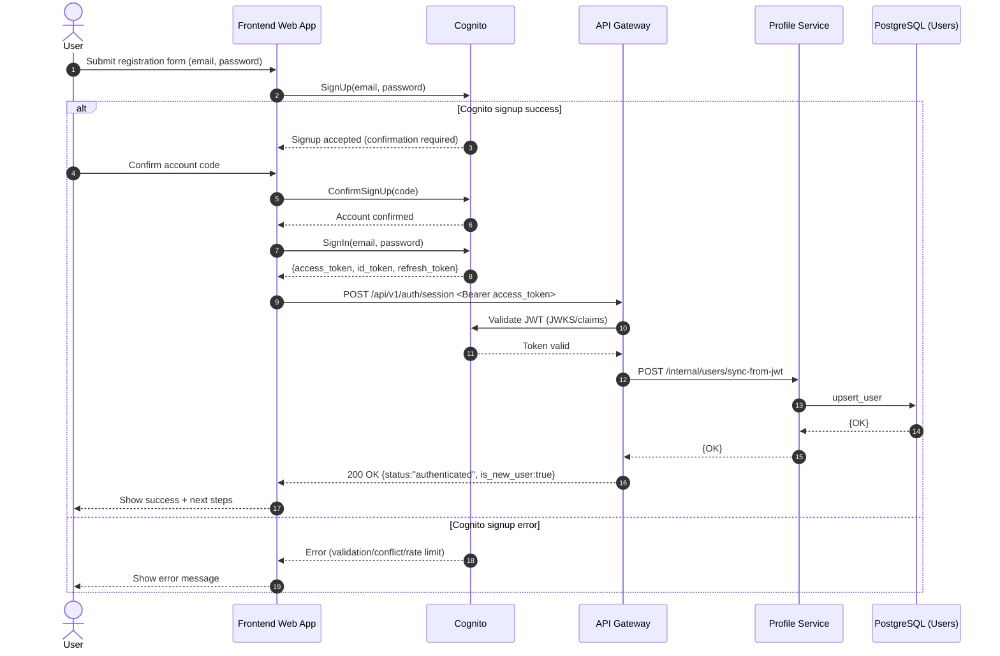

# Sequence Diagram: Create User Flow

## Purpose

Describe the first end-to-end flow of the system using direct frontend authentication with Cognito, followed by backend user synchronization.

## Flow 01: Register User

