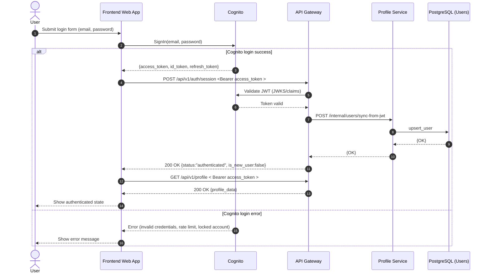

# Sequence Diagram: Login Flow

## Purpose

Describe the login flow where the frontend authenticates with Cognito and then starts an application session in API Gateway using JWT.

## Flow 02: Log User

