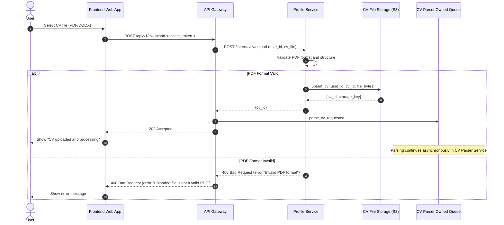

# Sequence Diagram: CV Upload Flow

## Purpose

Describe the end-to-end flow for uploading a CV, storing the file, and triggering asynchronous parsing.

## Flow 03: Upload CV

```mermaid
sequenceDiagram
    autonumber
    actor U as User
    participant FE as Frontend Web App
    participant API as API Gateway
    participant PROFILE as Profile Service
    participant S3 as CV File Storage (S3)
    participant QP as CV Parser Owned Queue

    U->>FE: Select CV file (PDF/DOCX)
    FE->>API: POST /api/v1/cv/upload <access_token >

    API->>PROFILE: POST /internal/cv/upload (user_id, cv_file)
    PROFILE->>PROFILE: Validate PDF format and structure
    
    alt PDF Format Valid
        PROFILE->>S3: upsert_cv (user_id, cv_id, file_bytes)
        S3-->>PROFILE: {cv_id, storage_key}
        PROFILE-->>API: {cv_id}

        API->>QP: parse_cv_requested 
        API-->>FE: 202 Accepted 
        FE-->>U: Show "CV uploaded and processing"

        Note over QP: Parsing continues asynchronously in CV Parser Service
    else PDF Format Invalid
        PROFILE-->>API: 400 Bad Request {error:"Invalid PDF format"}
        API-->>FE: 400 Bad Request {error:"Uploaded file is not a valid PDF"}
        FE-->>U: Show error message
    end
```