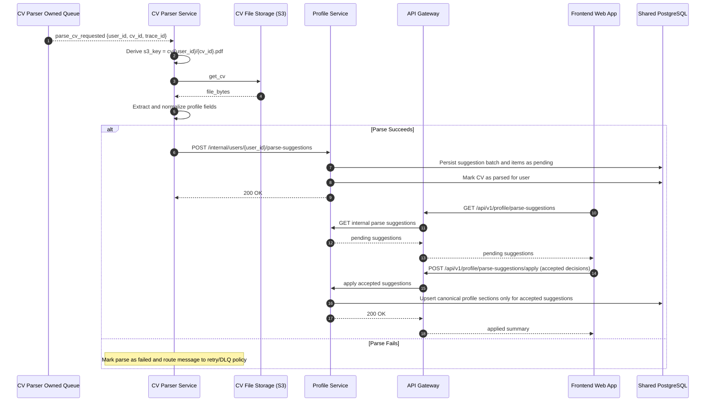

# Sequence Diagram: Parse CV Requested and Review Flow

## Purpose

Describe the asynchronous flow where CV Parser Service consumes a parse request, stores reviewable suggestions through Profile Service, and the user explicitly applies accepted changes.

## Flow 04: CV Parser Consumes parse_cv_requested with User Review

