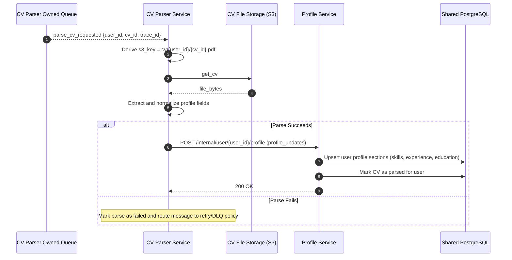

# Sequence Diagram: Parse CV Requested Flow

## Purpose

Describe the asynchronous flow where CV Parser Service consumes a parse request, reads the CV file, extracts structured profile data, and publishes the result.

## Flow 04: CV Parser Consumes parse_cv_requested

