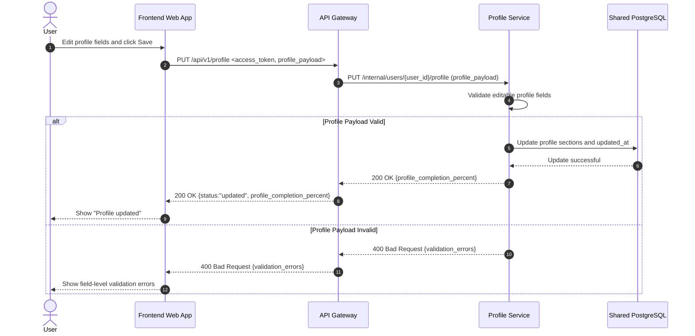

# Sequence Diagram: Manual Profile Edit Flow

## Purpose

Describe the end-to-end flow where the user manually updates profile information from the frontend.

## Flow 05: User Edits Profile Manually

## Notes

- This is a user-initiated synchronous update flow.
- Authentication is required, but JWT validation steps are omitted for diagram clarity.
- Only editable profile fields are accepted in this endpoint.
- In this MVP version, manual profile updates do not trigger matching automatically.
