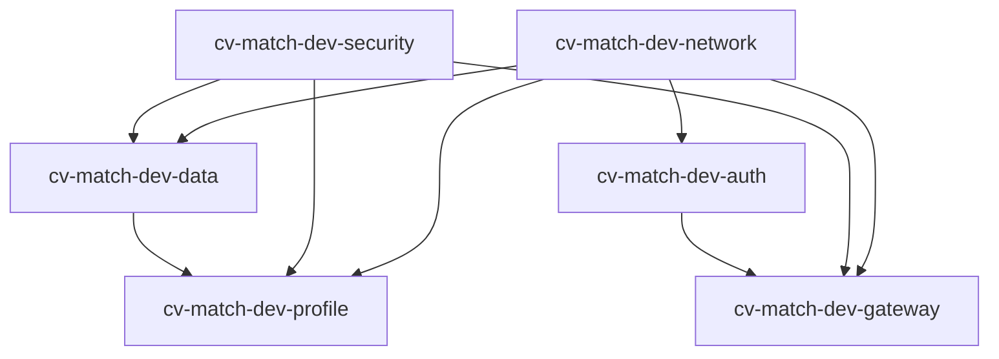

# Stack Dependency Graph

This graph reflects the current stack dependencies defined in `bin/foundation.ts`.

## Graph

## Direct Dependencies

- data: network, security
- auth: network
- profile: network, security, data
- gateway: network, security, auth

## Recommended Incremental Order

Use this order to reduce dependency-related failures.

Deploy order:

1. network
2. security
3. auth
4. gateway
5. data
6. profile

Destroy order (reverse):

1. profile
2. data
3. gateway
4. auth
5. security
6. network

## Notes

- These are stack-level dependencies declared with `addDependency(...)`.
- During destroy operations, CDK may include dependent stacks unless destroy is run in exclusive mode.